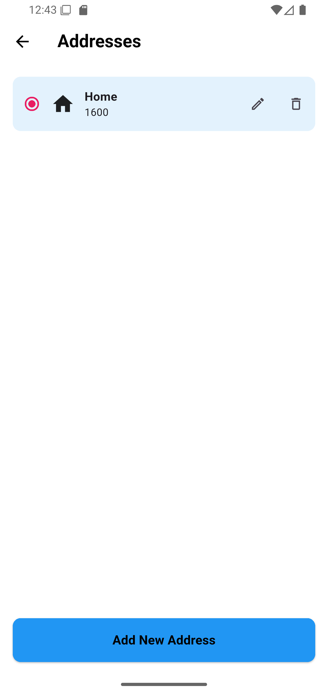
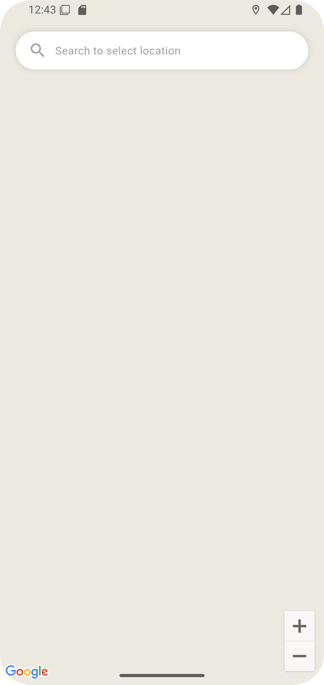
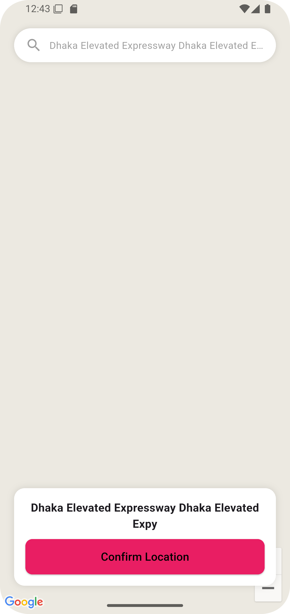

# 🗺️ Add New Location -- Flutter App

একটি প্রফেশনাল এবং সহজে ব্যবহারযোগ্য **Flutter Location Management
App**!\
এই অ্যাপটি ব্যবহার করে আপনি সহজেই লোকেশন যোগ, আপডেট এবং ম্যানেজ করতে
পারবেন।

------------------------------------------------------------------------

## 🚀 মূল বৈশিষ্ট্য (Features)

### 📍 ১. লোকেশন অ্যাড করা

সহজেই নতুন লোকেশন Latitude ও Longitude দিয়ে সেভ করা যায়।

### 🗂️ ২. লোকেশন লিস্ট

সকল সংরক্ষিত লোকেশন সুন্দর UI সহ লিস্ট আকারে দেখা যাবে।

### ✏️ ৩. আপডেট / এডিট

কোনো লোকেশন ভুল হলে অ্যাপ থেকে সরাসরি এডিট করার সুবিধা আছে।

### 🗑️ ৪. ডিলিট অপশন

এক ক্লিকে যেকোনো লোকেশন মুছে ফেলতে পারবেন।

### 📡 ৫. ব্যাকএন্ড সাপোর্ট

লোকেশন ডেটা Local Storage (SQLite/Hive) বা API--- উভয় দিয়েই কাজ করবে।

### 🎯 ৬. সহজ UI

সিম্পল, ক্লিন এবং প্রফেশনাল UI ডিজাইন।

------------------------------------------------------------------------

## 🖼️ Screenshots

চারটি স্ক্রিনশট এক লাইনে প্রদর্শন:

<table>
  <tr>
    <td></td>
    <td></td>
    <td></td>
    <td></td>
  </tr>
</table>

------------------------------------------------------------------------

## 📦 Installation

``` bash
git clone https://github.com/prothesbarai/add_new_location
cd add_new_location
flutter pub get
flutter run
```

------------------------------------------------------------------------

## 🗺️ ব্যবহার说明 (Usage)

-   অ্যাপ চালু করলে আপনি 'Add Location' বাটন দেখতে পাবেন\
-   ক্লিক করে Location ফর্ম ওপেন করুন\
-   Latitude / Longitude দিন\
-   Save করুন\
-   লিস্ট পেজে সব লোকেশন দেখুন

------------------------------------------------------------------------

## © 2025 -- prothesbarai
Flutter দিয়ে তৈরি একটি সুন্দর Location Management সিস্টেম।
