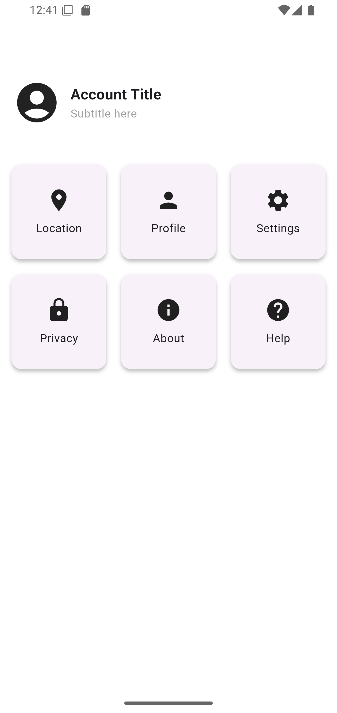
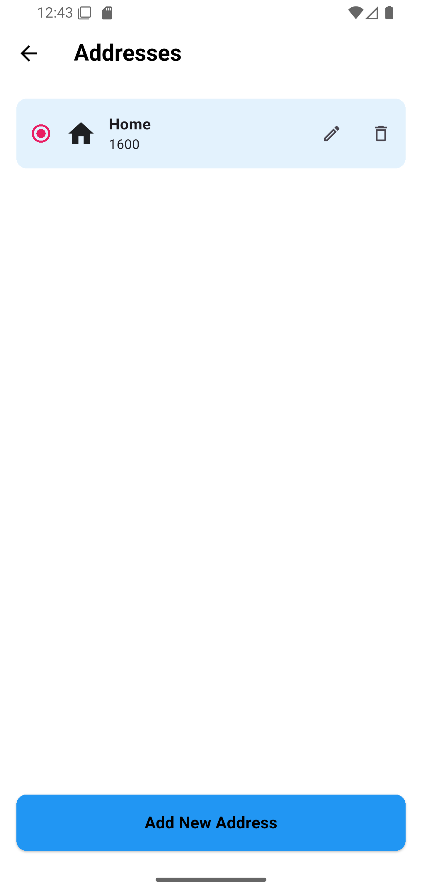
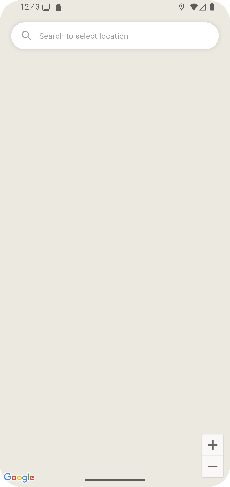
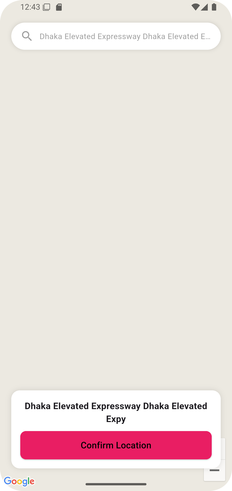

# 🗺️ Add New Location -- Flutter App

একটি প্রফেশনাল এবং সহজে ব্যবহারযোগ্য **Flutter Location Management
App**!\
এই অ্যাপটি ব্যবহার করে আপনি সহজেই লোকেশন যোগ, আপডেট এবং ম্যানেজ করতে
পারবেন।

------------------------------------------------------------------------

## 🚀 মূল বৈশিষ্ট্য (Features)

### 📍 ১. লোকেশন অ্যাড করা

সহজেই নতুন লোকেশন Latitude ও Longitude দিয়ে সেভ করা যায়।

### 🗂️ ২. লোকেশন লিস্ট

সকল সংরক্ষিত লোকেশন সুন্দর UI সহ লিস্ট আকারে দেখা যাবে।

### ✏️ ৩. আপডেট / এডিট

কোনো লোকেশন ভুল হলে অ্যাপ থেকে সরাসরি এডিট করার সুবিধা আছে।

### 🗑️ ৪. ডিলিট অপশন

এক ক্লিকে যেকোনো লোকেশন মুছে ফেলতে পারবেন।

### 📡 ৫. ব্যাকএন্ড সাপোর্ট

লোকেশন ডেটা Local Storage (SQLite/Hive) বা API--- উভয় দিয়েই কাজ করবে।

### 🎯 ৬. সহজ UI

সিম্পল, ক্লিন এবং প্রফেশনাল UI ডিজাইন।

------------------------------------------------------------------------

## 🖼️ Screenshots

চারটি স্ক্রিনশট এক লাইনে প্রদর্শন:

<table>
  <tr>
    <td></td>
    <td></td>
    <td></td>
    <td></td>
  </tr>
</table>

------------------------------------------------------------------------

## 📦 Installation

``` bash
git clone https://github.com/prothesbarai/add_new_location
cd add_new_location
flutter pub get
flutter run
```

------------------------------------------------------------------------

## 🗺️ ব্যবহার

-   অ্যাপ চালু করলে আপনি 'Add Location' বাটন দেখতে পাবেন\
-   ক্লিক করে Location ফর্ম ওপেন করুন\
-   Latitude / Longitude দিন\
-   Save করুন\
-   লিস্ট পেজে সব লোকেশন দেখুন

------------------------------------------------------------------------

------------------------------------------------------------------------
------------------------------------------------------------------------
## কিভাবে Google Maps API key বানাবে এবং Flutter project এ ব্যবহার করবে:
### 1️⃣ Google Cloud Console এ যান
- ব্রাউজারে গিয়ে যাও: https://console.cloud.google.com/
- Google account দিয়ে login করো।
  
### 2️⃣ Project তৈরি করুন
- If you want Create New Project (If no exist related projects)
- Project name দাও (যেমন: My Project 98110)
- Create চাপো

### 3️⃣ Maps API Enable করা
- Quick access (below) → APIs & Services → Library
- Search করো Maps SDK for Android → Enable
- Search করো Maps SDK for iOS → Enable
- Search করো Places API → Enable (search address এর জন্য)
- Search করো Geocoding API (For Convert addresses into geographic coordinates)
- Search করো Directions API (For Access driving, cycling, walking and public transportation routing with the Directions API using an HTTP request)
- Search করো Geolocation API (For জিওলোকেশন API ব্যবহার করে মোবাইল ক্লায়েন্ট যে সেল টাওয়ার এবং ওয়াইফাই অ্যাক্সেস পয়েন্টগুলি সনাক্ত করতে পারে তার মতো তথ্যের উপর ভিত্তি করে একটি অবস্থান এবং নির্ভুলতা ব্যাসার্ধ খুঁজুন। এটি মূলত এমন ক্ষেত্রে ব্যবহৃত হয় যেখানে জিপিএস সম্ভব বা উপযুক্ত নয়।)
- Search করো Maps JavaScript API (For Web)
- All Enable


### 4️⃣ API Key তৈরি কর
- APIs & Services → Credentials → Create Credentials → API key
- 1️⃣ Name তুমি API key 1 দিলে চলবে। নাম শুধু internal reference এর জন্য।
- 2️⃣ Authenticate API calls : সাধারণ Flutter map / search use এর জন্য unchecked রাখো। Service account দরকার নেই।
     <pre>
      Google Maps, Places API, Directions API, Geocoding → এগুলোর জন্য শুধু normal API key লাগে।
      ❌ Service account ব্যবহার করলে mobile app-এ নিরাপত্তা ঝুঁকি বাড়ে — কারণ service account key ফাঁস হলে বড় সমস্যা
      🚨 কেন Mobile App-এ Service Account রাখা বিপজ্জনক?
            মোবাইল অ্যাপ open source type →
            APK extract করে →
            → তার ভিতরের files/public assets →
            → খুব সহজে কেউ দেখতে পারবে।
       
       যদি তুমি ভুল করে mobile app-এ service account JSON file দাও:
       তখন হ্যাকার কী করতে পারবে?
            ❌ তোমার বিনামূল্যে Google Cloud ব্যবহার করতে পারবে
            ❌ Google Maps এর বিল লাখ টাকায় উঠতে পারে
            ❌ Firebase database ডিলিট বা চেঞ্জ করতে পারে
            ❌ Storage bucket wipe করে দিতে পারে
            ❌ Service account দিয়ে তোমার পুরো project hack করতে পারবে   
     কারণ:
       👉 Service account = Full Admin Access
       👉 Mobile app = Public
       👉 যে কেউ key চুরি করতে পারবে
       
   🔥 Normal API Key কেন Safe?
       Normal API Key safe কারণ:
         (A) Restrictions দেওয়া যায়
            Android package + SHA1
            iOS bundle ID
            Web domain
            IP address
            Allowed APIs list
            যদি key leak হয়ে যায়, কেউ ব্যবহার করতে পারবে না।
        (B) Normal API Key এর power limited
            Billing system access নেই
            Database admin নয়
            Cloud project control নেই
            Only Maps-related specific APIs access করতে পারে

       ⭐ সহজ কথায় সারসংক্ষেপ:
       🔐 Service Account
            ➡ খুব Powerful
            ➡ Server/back-end এর জন্য
            ➡ Mobile app-এ দিলে হ্যাকার তোমার পুরো Google Cloud hack করতে পারবে
            ➡ তাই Google strictly বলে: "NEVER put service account in mobile app"

      🔑 Normal API Key
            ➡ Client-side + Mobile app এর জন্য
            ➡ Restriction দিয়ে 100% safe করা যায়
            ➡ Maps, Places, Directions, Geocoding এর জন্য এটাই ব্যবহার করতে হবে
     </pre>
- 3️⃣ Application restrictions : তুমি এখন None রেখেছো → test এর জন্য ঠিক আছে। পরে security increase করতে চাইলে Android/iOS restrict করতে হবে।
    <pre>
       Application Restrictions — এটা কী?
       এটা বলে দিচ্ছে API key কোথা থেকে ব্যবহার হবে।
       অপশনগুলো:
       🔵 None (তুমি এখন যে ব্যবহার করছো)
          যেকোনো জায়গা থেকে API key ব্যবহার করা যাবে। Development/test phase এ এটা ঠিক আছে।
          কিন্তু production-এ risky → কেউ তোমার key ব্যবহার করতে পারবে।
       🌐 Websites
         যদি API key শুধু Web site (domain) থেকে চালাতে চাই।
         তখন তুমি domain দেবে → যেমন: https://prothes.com
         Web ছাড়া অন্য জায়গা থেকে key কাজ করবে না।
      🌍 IP addresses
         Server থেকে API call হলে ব্যবহার হয়।
         তুমি server এর IP দেবে → অন্য IP থেকে key চলবে না।
      🤖 Android apps
         Android app এর package name + SHA-1 certificate দিতে হবে।
         মানে শুধু তোমার অ্যাপই key ব্যবহার করতে পারবে।
         Need : Package: com.prothes.mapapp   & SHA1: DA:22:34:...
      🍏 iOS apps
         iOS এর bundle ID দিতে হবে → শুধু ওই অ্যাপই key ব্যবহার করবে।
    </pre>
- 4️⃣ API restrictions : তুমি Don't restrict key রেখেছো → সব API call যাবে। Later তুমি শুধু Maps SDK, Places API restrict করতে পারো।
       <pre>
        API Restrictions — এটা কী? এটা control করে API key দিয়ে কোন কোন API call করা যাবে ?
        ২টা অপশন:
        🔓 Don't restrict key
               সব Google API access পাবে
               বড় security risk (key leak হলে অন্য কেউ AI, SMS, Map সব টাকা খরচ করে ফেলতে পারে)
        🔐 Restrict key (recommended)
               তুমি manually select করবে API
               যেমন তুমি Flutter app-এ ব্যবহার করবে:
                   ✔ Maps SDK for Android
                   ✔ Places API
                   ✔ Geocoding API
                   ✔ Maps Static API
               → তাহলে Google বলবে: এই key শুধু এই API গুলোতেই কাজ করবে।
       </pre>
- Check :
       <pre>
           🔥 Final Recommendation (Best Practice)
            Development/test:
                  ✔ None
                  ✔ Don’t restrict (optional)
            Production:
                  ✔ Application restriction → Android apps
                  ✔ API restriction → specific API (Maps, Places etc)
                <hr>
           🔵 A) ANDROID (Production)
                  Application restrictions → Android apps
                  এখানে:
                       Package name (e.g. com.prothes.mapapp)
                       SHA-1 certificate fingerprint
                       দু'টাই দিতে হবে।
                  API restrictions → Restrict key
                  Then select:
                       ✔ Maps SDK for Android
                       ✔ Places API
                       ✔ Geocoding API (optional)
                       ✔ Directions API (optional)
                       ✔ Places API (New)
                       ✔ Maps Static API (optional)
             ➡ এটাই 100% Perfect Android Production Setup
            <hr>
            🔵 C) WEB (Production)
                 🔐 এখানে key leak এর chance বেশি—সুতরাং Web restriction MUST.
                    Application restrictions → Websites
                   এখানে domain গুলো দেবে:
                        https://prothes.com
                        https://www.prothes.com
                    Localhost (development):
                        http://localhost:3000
                        http://127.0.0.1:3000
                    API restrictions → Restrict key
                    Select:
                         ✔ Maps JavaScript API
                         ✔ Places API
                         ✔ Geolocation API
                         ✔ Geocoding API
                         ✔ Maps Static API (optional)
                     ➡ Web Production নিরাপদ হবে।
      </pre>
- 5️⃣ পরবর্তী step : Create চাপো → copy করা key নিয়ে Flutter code এ বসাও:


### 5️⃣ Key কে Restrict করা (optional but recommended)
- Restrict Key → HTTP referrers (web sites) বা Android apps / iOS apps
- Android: package name + SHA1 fingerprint
- iOS: Bundle Identifier
- Note: Restrict না করলে key সব জায়গা থেকে কাজ করবে, কিন্তু security কমে।


## © 2025 -- prothesbarai
Flutter দিয়ে তৈরি একটি সুন্দর Location Management সিস্টেম।
